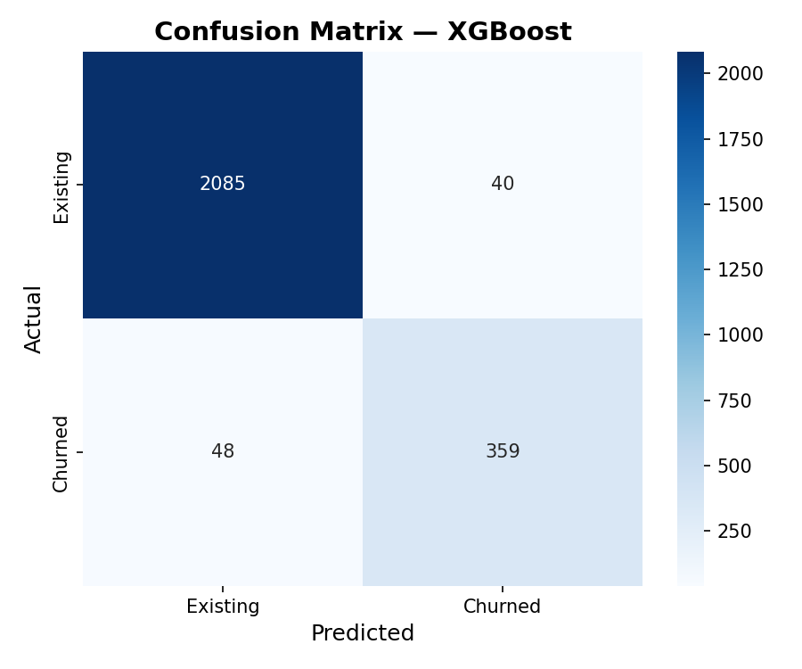
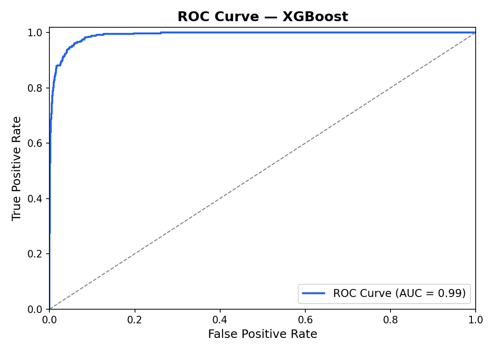
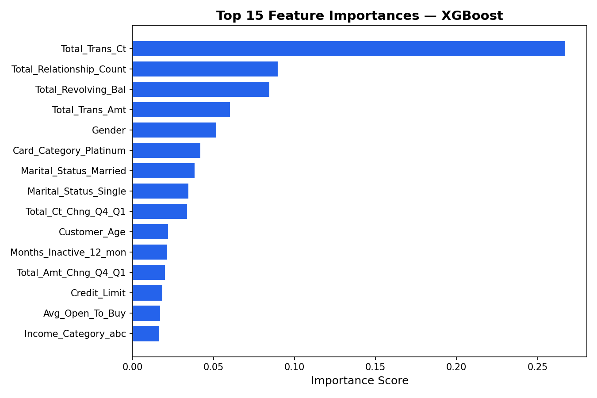

# 💳 Credit Card Customer Churn Prediction

A machine learning classification project to predict which credit card customers are at risk of churning, enabling Thera Bank to proactively retain valuable customers.

---

## 📌 Problem Statement

Customer churn is one of the most costly problems in banking. Acquiring a new customer costs 5–25× more than retaining an existing one. This project builds a predictive model to identify customers likely to close their credit card accounts — giving the bank time to intervene with targeted retention strategies.

---

## 📊 Dataset

- **Source:** Thera Bank Credit Card Customer Dataset
- **Size:** 10,127 customers, 21 features
- **Target variable:** `Attrition_Flag` (Existing Customer / Attrited Customer)
- **Class imbalance:** ~84% existing, ~16% churned

**Key features include:**
- Total transaction count & amount (last 12 months)
- Revolving balance & credit limit utilisation
- Months on book & relationship count
- Customer demographics (age, gender, income, education)

---

## 🔍 Approach

### 1. Exploratory Data Analysis (EDA)
- Distribution of churned vs retained customers
- Correlation analysis between features
- Key churn indicators identified visually

### 2. Data Preprocessing
- Dropped irrelevant columns (`CLIENTNUM`, naive Bayes columns)
- Encoded categorical variables (Label Encoding & One-Hot Encoding)
- Handled class imbalance using:
  - **SMOTE** (Synthetic Minority Over-sampling Technique)
  - **Random Undersampling**

### 3. Models Trained & Compared

| Model | Recall | AUC |
|---|---|---|
| Logistic Regression | 0.6781 | 0.8713 |
| Decision Tree | 0.8206 | 0.8809 |
| Random Forest | 0.8526 | 0.9814 |
| AdaBoost | 0.8452 | 0.9583 |
| Gradient Boosting | 0.8722 | 0.9856 |
| **XGBoost** | **0.8771** | **0.9915** |

### 4. Hyperparameter Tuning
- Grid Search CV used on top models
- Optimised for **Recall** (minimise false negatives — missing a churner is costly)

---

## 🏆 Results

**Best Model: XGBoost (with SMOTE)**

- **Recall (Churn class):** 87.71%
- **Precision:** 90.00%
- **F1-Score:** 89.00%
- **Accuracy:** 97.00%
- **ROC-AUC:** 99.15%

---

## 💾 Saved Model

The best-performing XGBoost model is saved as:

```text
models/best_model.pkl
```

This model can be loaded and used for future customer churn predictions without retraining.

---

## 📈 Model Evaluation

### Confusion Matrix



### ROC Curve



### Feature Importance



---

## ⚙️ Best XGBoost Parameters

```text
learning_rate: 0.05
max_depth: 7
n_estimators: 200
subsample: 0.8
```

---

## 💡 Key Business Insights

1. **Total Transaction Count** is the strongest predictor — customers with fewer transactions are far more likely to churn
2. **Revolving Balance** matters — low balance customers show higher churn risk
3. **Relationship Count** — customers with fewer products have less loyalty
4. **Months Inactive** — inactivity over 2–3 months is a strong warning signal

**Recommendations:**
- Trigger retention campaigns when transaction count drops below threshold
- Offer loyalty rewards to customers with only 1 product
- Create re-engagement emails for customers inactive >2 months

---

## 🛠️ Tech Stack

- **Python 3.9+**
- **Pandas, NumPy** — data manipulation
- **Matplotlib, Seaborn** — visualisation
- **Scikit-learn** — ML models, preprocessing, evaluation
- **XGBoost** — gradient boosting
- **Imbalanced-learn** — SMOTE, undersampling

---

## 📁 Project Structure

```text
credit-card-churn-prediction/
│
├── data/
│   └── BankChurners.csv
│
├── notebook/
│   └── credit_card_churn_prediction.ipynb
│
├── src/
│   ├── preprocess.py
│   ├── train.py
│   ├── evaluate.py
│   └── generate_plots.py
│
├── models/
│   └── best_model.pkl
│
├── images/
│   ├── feature_importance.png
│   ├── confusion_matrix.png
│   └── roc_curve.png
│
├── requirements.txt
├── LICENSE
└── README.md
```

---

## ⚙️ How to Run

**1. Clone the repository**
```bash
git clone https://github.com/ColinLim20583/credit-card-churn-prediction.git
cd credit-card-churn-prediction
```

**2. Install dependencies**
```bash
pip install -r requirements.txt
```

**3. Run the notebook**
```bash
jupyter notebook notebook/credit_card_churn_prediction.ipynb
```

**4. Or run training script directly**
```bash
python src/train.py
```

---

## 📄 License

This project is open source under the [MIT License](LICENSE).

---

## 👤 Author

**Colin Lim**
- GitHub: [ColinLim20583](https://github.com/ColinLim20583)
- LinkedIn: [Colin Lim](https://www.linkedin.com/in/colin-lim1983/)
